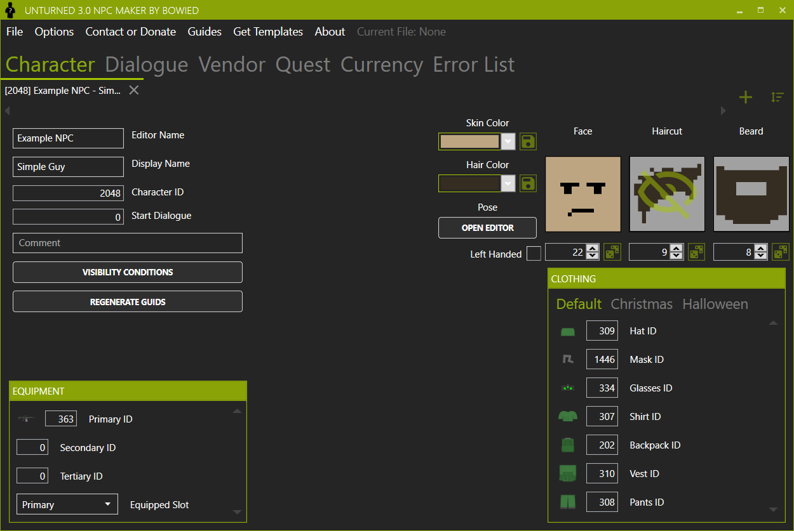
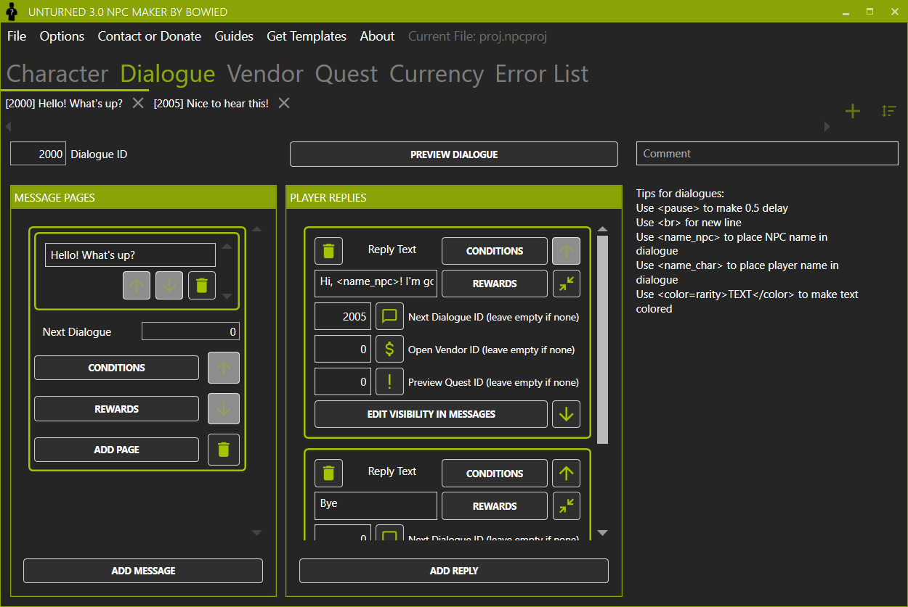
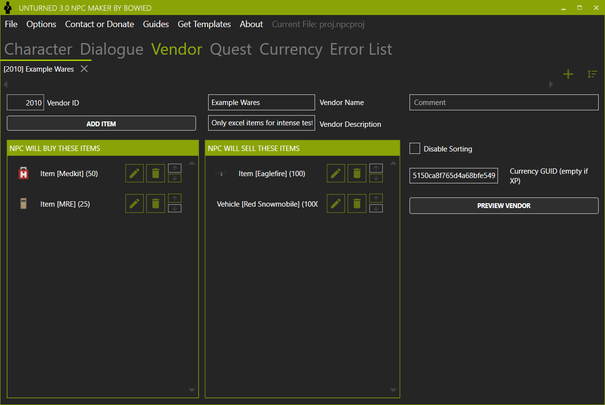
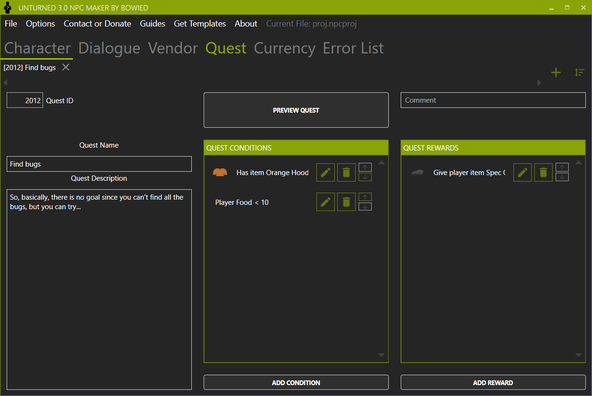
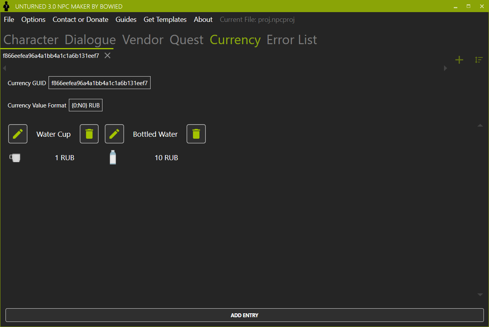

# NPC Maker for Unturned 3.0 by BowieD

## Download

Download [latest version](https://github.com/iBowie/BowieD.Unturned.NPCMaker/releases/latest/download/BowieD.Unturned.NPCMaker.exe)

## Key Features

### Character editor

### Dialogue editor and preview

### Vendor editor and preview

### Quest editor and preview

### Import Unturned assets

| Asset Selector | NPC Selector  |
| - | - |
|  |  |

### Currency editor

## System Requirements

### Minimal
* OS: Windows 10 (Update 1607+) / Windows 8.1 / Windows 7 SP1
* RAM: 256 MB
* .NET Framework 4.7.2

### Recommended
* OS: Windows 10 (Latest Update)
* RAM: 2 GB
* .NET Framework 4.7.2
* Beefy PC for item icons and search highlight

## Price
This application is free-to-use, and will not be sold under any circumstances.

## How to use it?
If you need help with how the app works - check guides in the app or ask in our [Discord server](https://discord.gg/Geqtkx2)
